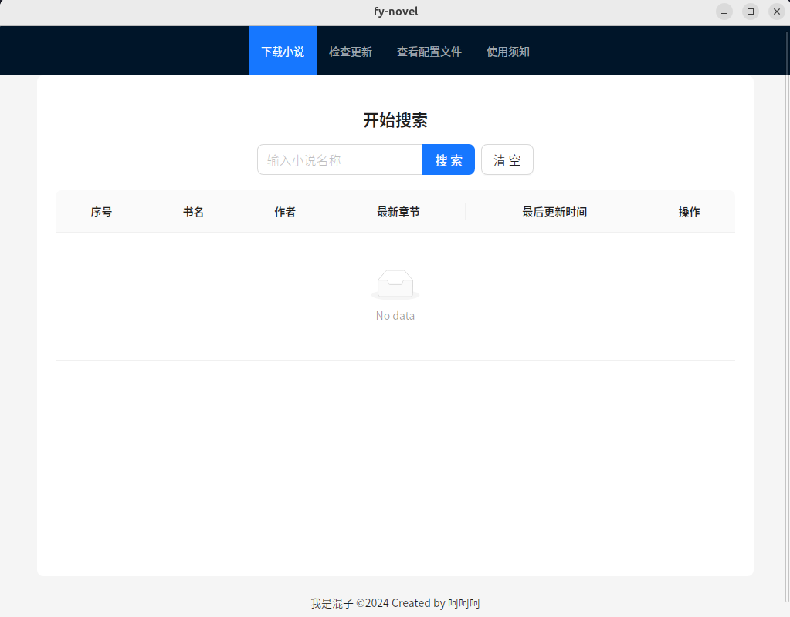
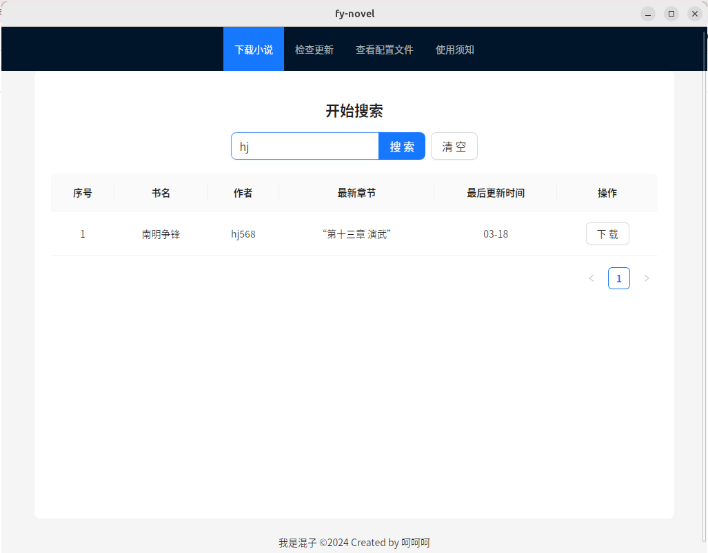

# fy-novel

English | [中文](../README.md)

## Introduction

A tool for users who want to read new books for free and seek the best reading experience.

Nowadays, most Chinese web novels are completed works. If you want to read new books, you may need to pay on official platforms, use websites like "Biquge", or use Android apps like "Reader".

While these two methods are sufficient for most people, they may not satisfy everyone. Some may complain about the interface, others may criticize the lack of features, or be limited by the platform. This is where the advantages of e-readers come into play: customization. The main purpose of this tool is to download serialized new books in epub format, which can then be imported into your preferred e-reader.

As for completed novels, they can also be searched and downloaded. If there are typos or formatting errors, it's advisable to search for a proofread version.

## Usage Guide

**Please note that some sources may not support proxy access!**

## Disclaimer

This program is a practice project for the author to learn the Go language. The author is not responsible for any issues that may arise from its use!!!